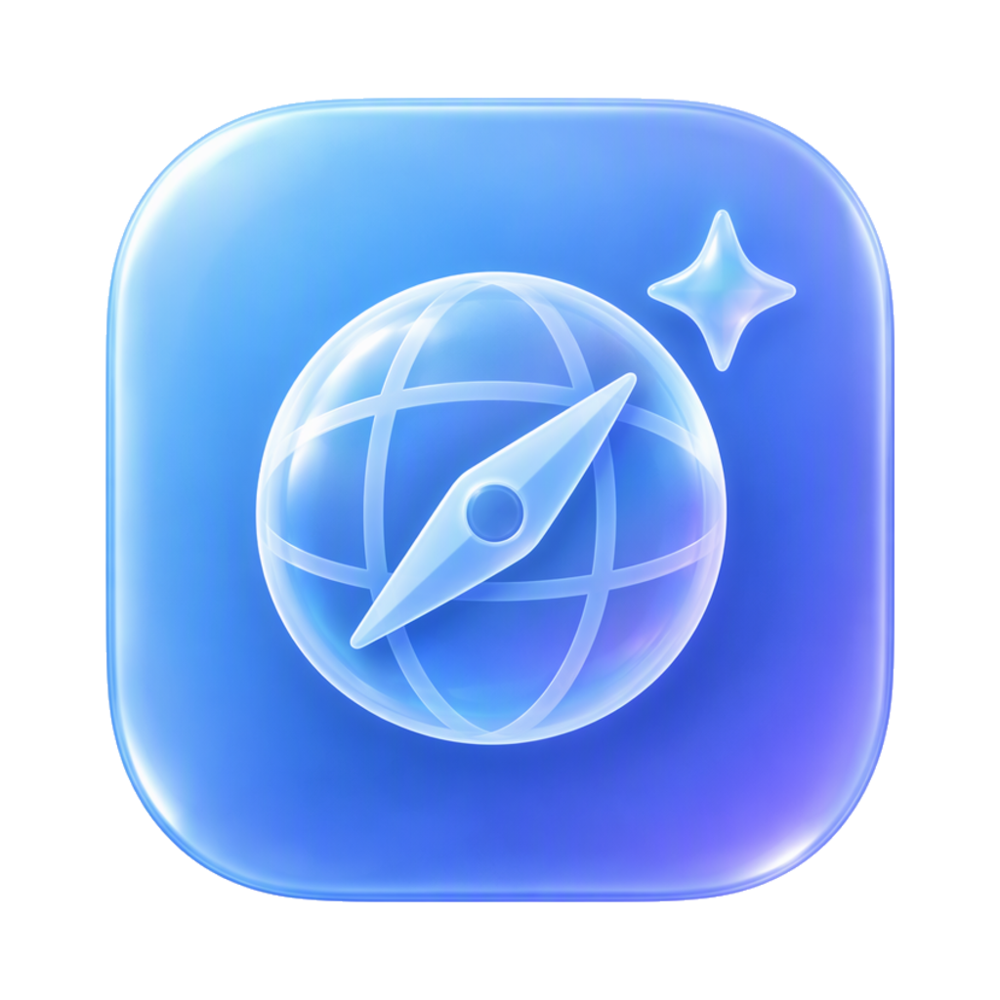

<p align="center">
  
</p>

# Tiller

A small macOS browser built on Chromium, with a native Swift/AppKit interface and a built-in agent panel that can drive the browser.

Website: [sorrycc.github.io/Tiller](https://sorrycc.github.io/Tiller/)

https://github.com/user-attachments/assets/1960eca0-6cb0-460b-bb6f-b292b739a147

## Features

- **Chromium engine, native shell.** Pages render with Chromium through CEF; the window, tabs and menus are AppKit.
- **Tabs and session restore.** Tabs along the top or in a sidebar, with a context menu; open tabs and recently closed tabs survive restarts and crashes, and the start page brings the closed ones back.
- **The usual browser things.** Find in page, zoom, print, a link's address under the mouse, pages going full screen, Chromium's developer tools and view source.
- **Downloads.** Files go to `~/Downloads`, with progress in the toolbar.
- **Import from Chrome.** Cookies, saved passwords, history, extensions, search engine and homepage.
- **Chrome extensions.** Add unpacked folders or CRX files, or bring Chrome's over. Content scripts, background workers and popups run; Chrome's tab and window APIs don't see Tiller's tabs.
- **Profiles.** Each profile has its own site data, history, passwords, settings and chats, and runs as its own app instance.
- **Agent panel.** Chat with Qoder CLI, Claude Code, Codex, Antigravity CLI or Grok Build in a side panel that controls the browser, and call skills with `/`, from your own folders or a skill library each agent shares. Prompts can also run on a schedule, skills included, set up in Settings or by asking the agent.
- **Browser tools.** A stdio MCP server and the `tiller` command-line tool expose the same tools to external agents and scripts.

## Requirements

- macOS with the Swift toolchain (Xcode Command Line Tools)
- Rust, installed through [rustup](https://rustup.rs)
- [Ninja](https://ninja-build.org)
- CEF 154, matching the `cef` version pinned in `Cargo.toml`

## Setup

Install the toolchain and download CEF once:

```sh
curl --proto '=https' --tlsv1.2 -sSf https://sh.rustup.rs | sh
brew install ninja
git clone https://github.com/tauri-apps/cef-rs && cd cef-rs
git checkout cef-v154.2.0+154.0.28
cargo run -p export-cef-dir -- --force $HOME/.local/share/cef
```

The build reads CEF from `$CEF_PATH`, which defaults to `~/.local/share/cef`. Update the download whenever the pinned `cef` version changes.

That download can't play H.264 video or AAC audio, which X, most news sites and most MP4 files use, because the stock CEF builds leave those patent-encumbered codecs out. To play them, put a CEF framework built with `proprietary_codecs=true` in `~/.local/share/cef-codecs`. The build uses the framework there when present, and the headers from `$CEF_PATH` either way. [aiexkwan/aurix-cef](https://github.com/aiexkwan/aurix-cef/releases) publishes such a build for the same Chromium as the pinned CEF, made by a third party and unsigned, so check that it's one you're willing to run:

```sh
brew install zstd
mkdir -p ~/.local/share/cef-codecs
curl -L https://github.com/aiexkwan/aurix-cef/releases/download/cef-154.0.26-codecs/cef-154.0.26-macosarm64-slim.tar.zst \
  | tar --use-compress-program=unzstd -x -C ~/.local/share/cef-codecs
```

Or build CEF yourself with `proprietary_codecs=true ffmpeg_branding=Chrome` and copy its framework there. Set `CEF_FRAMEWORK_DIR` to use a framework from another folder. The framework's version must share the pinned CEF's major version and API hash; the script prints the one it picked.

## Build and run

```sh
scripts/bundle.sh                                       # release build; pass `debug` for a debug build
open build/Tiller.app
open build/Tiller.app --args -url https://example.com   # open a page at launch
```

The script builds the Rust crates and the Swift app, then assembles an ad-hoc signed `build/Tiller.app`, which doesn't update itself. To keep the bundle small, it includes only the English and Chinese Chromium locales and omits SwiftShader, so there is no software rendering fallback when the GPU is unavailable.

## Releasing

Releases are signed with a Developer ID, notarized, and published on GitHub as `Tiller-<version>.dmg` for installing and `Tiller-<version>.zip` for [Sparkle](https://sparkle-project.org), which updates installed copies from the appcast at `https://sorrycc.github.io/Tiller/appcast.xml`. A version with a pre-release part, such as `0.2.0-beta.1`, is a beta: a GitHub pre-release that only Tillers with Settings > General > Include beta versions turned on update to.

To release, set `version` in `Cargo.toml`, commit, and either push the tag `v<version>` to have the Release workflow do it, or run `scripts/release.sh` on a Mac set up as below. `scripts/fetch-cef.sh` downloads CEF and the codecs build for the workflow, checking the codecs archive against a pinned hash.

One-time setup:

1. In the Apple Developer site, create a **Developer ID Application** certificate and install it in your login keychain. Export it from Keychain Access as a `.p12` with a password.
2. At [account.apple.com](https://account.apple.com), create an app-specific password for notarization.
3. Make Sparkle's update signing key with `app/.build/artifacts/sparkle/Sparkle/bin/generate_keys` (after a build), which keeps it in your keychain and prints the public key. Put that in `scripts/sparkle-public-key` and commit it. `generate_keys -x sparkle-private-key` exports the private key for the workflow; delete the file afterwards.
4. In the repository's Settings > Secrets and variables > Actions, add:

   | Secret | Value |
   |---|---|
   | `MACOS_CERTIFICATE_P12` | `base64 -i certificate.p12` |
   | `MACOS_CERTIFICATE_PASSWORD` | the `.p12`'s password |
   | `APPLE_ID` | your Apple Account email |
   | `APPLE_APP_SPECIFIC_PASSWORD` | the app-specific password |
   | `APPLE_TEAM_ID` | your team ID |
   | `SPARKLE_PRIVATE_KEY` | the exported private key |

5. After the first release creates the `gh-pages` branch, turn on GitHub Pages for it in Settings > Pages.
6. To release from your Mac too, store notarization credentials once: `xcrun notarytool store-credentials tiller-notary --apple-id <email> --team-id <team> --password <app-specific password>`.

## Driving the browser

Agents in the panel use Tiller's browser tools automatically. External agents and scripts can use the MCP server at `build/Tiller.app/Contents/MacOS/tiller_mcp`, or the `tiller` command-line tool, installed from Tiller > Install Command Line Tool…:

```sh
tiller new example.com      # open a tab and wait for the load
tiller read                 # page text with numbered links, buttons and fields
tiller click 3
tiller type 5 "hello" --submit
```

See [Browser tools](docs/tools.md) for every tool, command and option.

## Project layout

| Path | Description |
|---|---|
| `core/` | Rust static library linked into the app. Loads CEF and owns the browsers. |
| `helper/` | Rust binary for the CEF subprocesses. |
| `mcp/` | Rust crate with the browser tools, the `tiller_mcp` MCP server and the `tiller` command-line tool. |
| `app/` | SwiftPM package with the AppKit app. No Xcode project is required. |
| `scripts/bundle.sh` | Builds everything and assembles `build/Tiller.app`. Signs it with `TILLER_SIGN_IDENTITY` when set. |
| `scripts/release.sh` | Signs, notarizes and publishes a release, and adds it to the appcast. |

## Documentation

| Guide | Covers |
|---|---|
| [Using the browser](docs/browser.md) | Tabs, find and zoom, address bar, history, saved passwords, Chrome import, profiles |
| [Agent panel](docs/agent.md) | Chats, image attachments, skills, scheduled prompts, agent permissions, Codex isolation |
| [Browser tools](docs/tools.md) | MCP server, command-line tool, debug launch arguments |
| [Settings and data](docs/settings-and-data.md) | Settings, Chromium switches, data folder, environment variables, migrations |

## License

[MIT](LICENSE)
